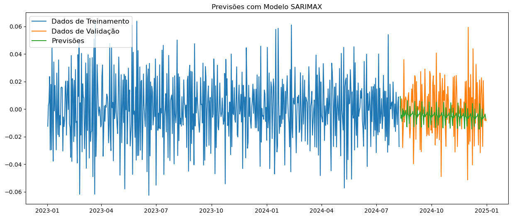
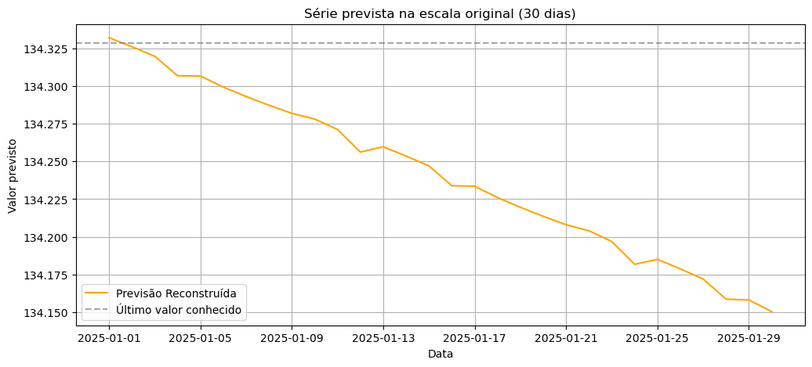

# 📦 Supply Chain: Previsão de Demanda com Séries Temporais

Este projeto utiliza técnicas de modelagem de séries temporais para prever a demanda de insumos em um contexto de **Supply Chain**, ajudando na tomada de decisão para planejamento logístico e de estoques.

---

## 🚀 Objetivo

- Desenvolver um modelo preditivo para estimar a demanda futura de insumos em Kg, baseado em dados históricos.
- Auxiliar o planejamento de compras e produção, minimizando rupturas e excessos de estoque.

---

## 🗂️ Dados

- **Fonte:** Dados fictícios simulados para fins de estudo.
- **Período:** 2023-01 a 2025-06.
- **Variáveis principais:**
  - `data`: data da demanda.
  - `demanda_insumos_kg`: quantidade demandada em Kg.

---

## 🔍 Metodologia

- **Exploração de dados (EDA):**
  - Análise da sazonalidade, tendência e componentes residuais.
- **Transformações:**
  - Aplicação de log para estabilizar variância.
  - Aplicação de diferenciação para tornar a série estacionária.
- **Modelagem:**
  - Uso do modelo **SARIMAX** para capturar tendência, sazonalidade e efeitos externos.
- **Avaliação:**
  - Verificação dos resíduos do modelo.
- **Forecast:**
  - Projeção da demanda para os próximos 30 dias.

---

## 📈 Resultados

- Gráficos de decomposição e previsão mostrando alinhamento do modelo com o comportamento histórico.
- Previsões exportadas para auxiliar análises futuras.
- 
- 

---

## 🛠️ Ferramentas e Bibliotecas

- Python (Jupyter Notebook)
- pandas, numpy, matplotlib, seaborn
- statsmodels (SARIMAX)

---

## 📂 Como executar

1. Clone o repositório:
   ```bash
   git clone https://github.com/jaquelinesfernandes/SuplyChain_TimesSeries.git


2. Abra o notebook: 
    ```bash 
    jupyter notebook project_suplychain_ts.ipynb


✍️ Autora
|          [Jaqueline Fernandes](https://github.com/jaquelinesfernandes)          |
